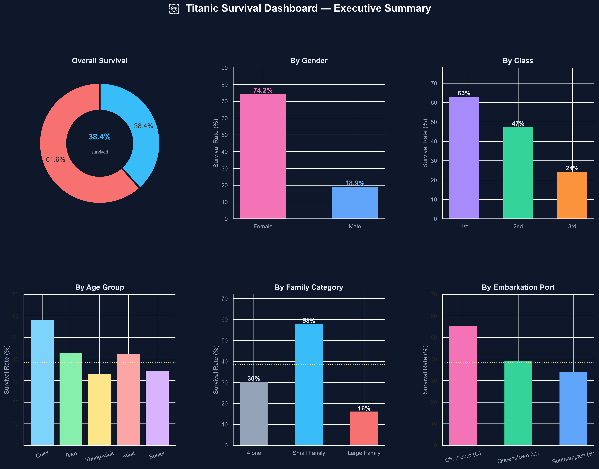
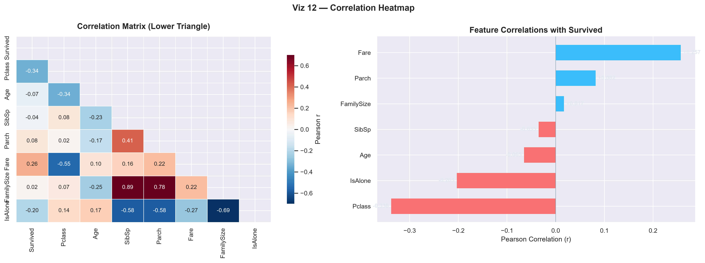
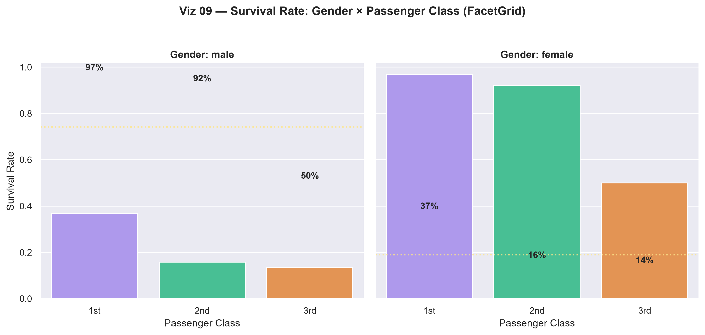
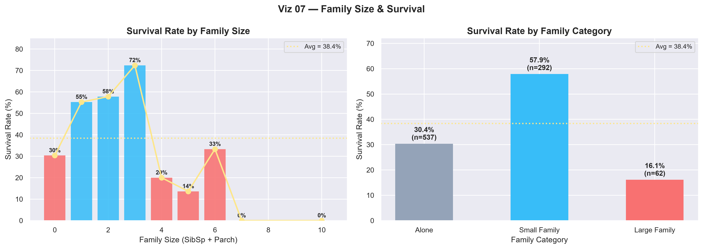

<div align="center">


<br>


<br><br>


</div>

<br>

## 📖 About This Repository

**Applied Data Science Projects** is a portfolio of four hands-on analytics projects, each built as a complete, end-to-end workflow — from raw, messy data to clear, actionable insight.

Instead of jumping straight to model-building, each project slows down to actually *understand* the data first: cleaning it, questioning it, visualizing it, and letting the patterns speak before drawing conclusions.

<div align="center">

*"Data becomes valuable only when it is transformed into meaningful insights."*

</div>

<br>

## 🎯 Objectives

<div align="center">

| | | |
|:---:|:---:|:---:|
| 📂 Data Understanding | 🧹 Data Cleaning & Preprocessing | 📊 Exploratory Data Analysis |
| 📈 Statistical Analysis | 🎨 Data Visualization | 🔍 Pattern Discovery |
| 🧠 Feature Engineering | 📑 Insight Generation | 📖 Data Storytelling |

</div>

<br>

## 🛠️ Technology Stack

| Category | Tools & Libraries |
|:---|:---|
| Programming | Python |
| Data Analysis | Pandas, NumPy |
| Visualization | Matplotlib, Seaborn |
| Development | Jupyter Notebook |
| Version Control | Git, GitHub |

<br>

## 📂 Repository Structure

```text
Applied-Data-Science-Projects/
│
├── README.md
│
├── Task_01_Student_Performance_Analysis/
├── Task_02_Titanic_Survival_Analysis/
├── Task_03_Advanced_Titanic_EDA/
└── Task_04_Visualization_Dashboard/
```

<br>

## 🗂️ Project Index

| # | Project | Dataset | Focus Area | Status |
|:---:|:---|:---|:---|:---:|
| 01 | [Student Performance Analysis](#-task-01--student-performance-analysis) | UCI Student Performance | Educational Analytics | ✅ |
| 02 | [Titanic Survival Analysis](#-task-02--titanic-survival-analysis) | Kaggle Titanic | Survival Patterns | ✅ |
| 03 | [Advanced Titanic EDA](#-task-03--advanced-titanic-exploratory-data-analysis) | Kaggle Titanic | Feature Engineering | ✅ |
| 04 | [Visualization Dashboard](#-task-04--data-visualization-dashboard) | Kaggle Titanic | Dashboard Design | ✅ |

<br>

## 🌟 What Every Project Includes

<div align="center">

| | |
|:---|:---|
| ✔ Professional Jupyter Notebook | ✔ Feature Engineering |
| ✔ Data Cleaning Workflow | ✔ High-Quality Visualizations |
| ✔ Exploratory Data Analysis | ✔ Well-Documented Code |
| ✔ Statistical Insights | ✔ Portfolio-Ready Presentation |

</div>

<br>
<div align="center">


# 🚀 Project Showcase

</div>
<br>

## 📊 Task 01 — Student Performance Analysis
<sup>**Educational Data Analytics · Exploratory Data Analysis · Statistical Insights**</sup>

An end-to-end educational data analytics project uncovering the factors that influence student academic performance, built on two real-world datasets.

| | |
|:---|:---|
| **Objectives** | Assess dataset quality · Explore performance patterns · Compare Mathematics and Portuguese scores · Investigate demographic and social factors · Generate statistical insights |
| **Key Analysis** | Grade Distribution · Gender-Based Comparison · Study Time vs Grades · Failure Analysis · Attendance Analysis · Cross-Subject Comparison · Correlation Analysis |
| **Technologies** | `Python` `Pandas` `NumPy` `Matplotlib` `Seaborn` `Jupyter Notebook` |

<p align="center">


</p>

<br>

<div align="center">

</div>

<br>

## 🚢 Task 02 — Titanic Survival Analysis
<sup>**Data Cleaning · Exploratory Data Analysis · Survival Pattern Investigation**</sup>

An exploratory data analysis project examining how demographic and socioeconomic factors shaped passenger survival aboard the Titanic.

| | |
|:---|:---|
| **Questions Explored** | Who survived more? · Did passenger class influence survival? · How did age affect survival? · Did family size matter? · What demographic patterns emerged? |
| **Key Analysis** | Survival Distribution · Male vs Female Survival · Passenger Class Analysis · Age Distribution · Fare Distribution · Embarkation Port Analysis |
| **Technologies** | `Python` `Pandas` `NumPy` `Matplotlib` `Seaborn` `Jupyter Notebook` |

<p align="center">

</p>

<br>

<div align="center">

</div>

<br>

## 📈 Task 03 — Advanced Titanic Exploratory Data Analysis
<sup>**Advanced EDA · Feature Engineering · Group-Based Analysis · Data Storytelling**</sup>

A deeper dive into the Titanic dataset, extending the analysis with advanced feature engineering, grouped statistical breakdowns, and professional visual storytelling.

| | |
|:---|:---|
| **Objectives** | Improve data quality through preprocessing · Engineer analytical features · Perform grouped statistical analysis · Discover deeper survival patterns · Present findings visually |
| **Key Analysis** | Missing Value Analysis · Family Size Analysis · Survival by Age Group · Survival by Embarkation Port · Correlation Analysis · Feature Engineering · GroupBy Analysis · Data Storytelling |
| **Technologies** | `Python` `Pandas` `NumPy` `Matplotlib` `Seaborn` `Jupyter Notebook` |

<p align="center">


</p>
<p align="center">


</p>

<br>

<div align="center">

</div>

<br>

## 📊 Task 04 — Data Visualization Dashboard
<sup>**Visual Storytelling · Analytical Dashboards · Insight Communication**</sup>

A professional, publication-quality visualization dashboard built on the Titanic dataset — demonstrating how effective visual analytics turns raw data into clear, actionable insight.

| | |
|:---|:---|
| **Objectives** | Build a professional analytical dashboard · Compare demographics visually · Explore survival patterns using multiple chart types · Communicate findings with publication-quality graphics |
| **Dashboard Highlights** | Survival Distribution · Gender × Class Analysis · Family Size Analysis · Fare Distribution · Age Distribution · Age vs Fare Relationship · Correlation Heatmap · Embarkation Analysis · Missing Data Profile |
| **Technologies** | `Python` `Pandas` `NumPy` `Matplotlib` `Seaborn` `Jupyter Notebook` |

<p align="center">


</p>
<p align="center">


</p>

<br>

<div align="center">

</div>

<br>

## 💡 Skills Demonstrated

<table width="100%">
<tr>
<th width="33%">📊 Data Analysis</th>
<th width="33%">📈 Data Visualization</th>
<th width="34%">🧰 Tools & Practices</th>
</tr>
<tr valign="top">
<td>

- Exploratory Data Analysis
- Statistical Analysis
- Data Cleaning & Preprocessing
- Missing Value Handling
- Duplicate Detection
- Feature Engineering
- Correlation Analysis
- GroupBy Analysis
- Insight Generation

</td>
<td>

- Histograms & Bar Charts
- Scatter Plots
- Distribution Plots
- Correlation Heatmaps
- Boxplots & Violin Plots
- Facet Grids
- Comparative Visualizations
- Dashboard Design
- Visual Storytelling

</td>
<td>

- Python (Pandas, NumPy)
- Matplotlib & Seaborn
- Jupyter Notebook
- Git & GitHub
- Reproducible Workflows
- Clean Documentation

</td>
</tr>
</table>

<br>

## 📌 Repository Highlights

<div align="center">

| | |
|:---|:---|
| ✔ End-to-End Data Analysis Projects | ✔ Exploratory Data Analysis (EDA) |
| ✔ Professional Jupyter Notebooks | ✔ Statistical Analysis |
| ✔ Real-World Analytical Tasks | ✔ Professional Data Visualizations |
| ✔ Data Cleaning & Preprocessing | ✔ Well-Documented Code |
| ✔ Feature Engineering | ✔ Portfolio-Ready Project Structure |

</div>

<br>

<div align="center">

</div>

<br>

## 👩‍💻 About Me

<div align="center">

### Hifza Amir
**B.Tech – Computer Science & Engineering (Data Science)**

I enjoy solving analytical problems using data and transforming complex datasets into meaningful insights through visualization, statistical analysis, and machine learning.

I'm continuously building practical projects to strengthen my skills in Data Science, Analytics, Machine Learning, NLP, and Explainable AI — documenting my learning journey through real-world applications.

</div>

<br>

<div align="center">

### ⭐ If you found this repository interesting, consider giving it a star!

**Thanks for visiting! 😊**


</div>
