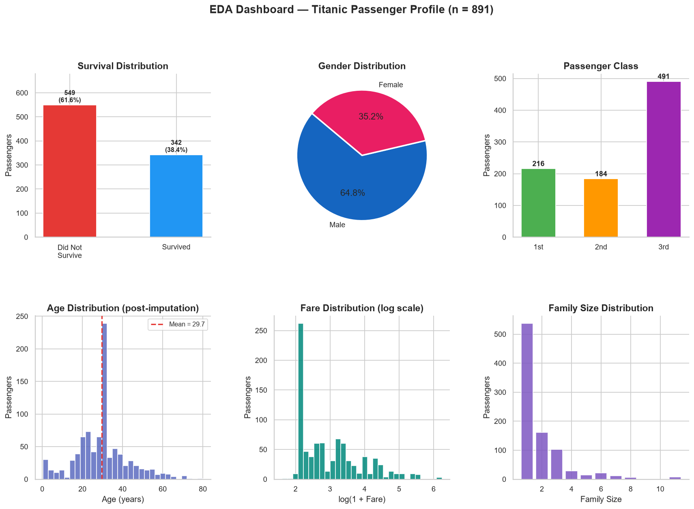
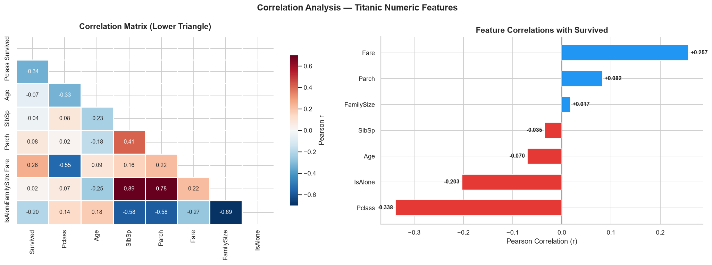
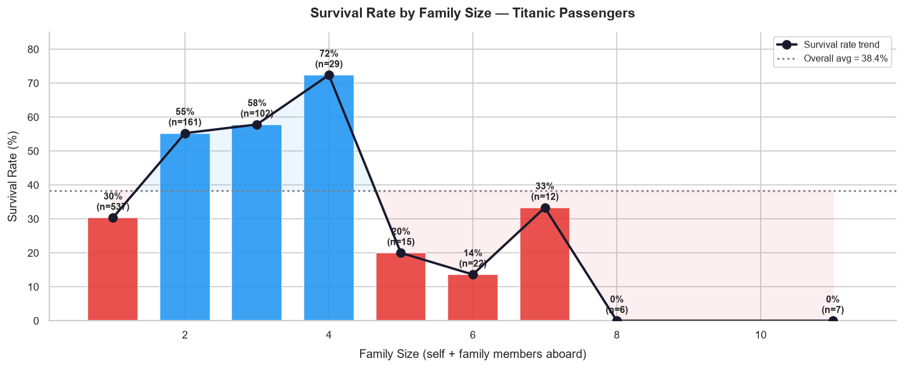
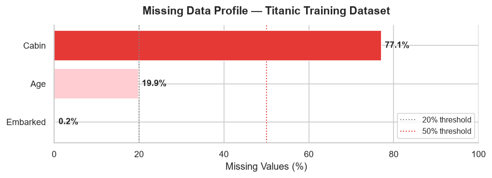

<div align="center">

# 📊 Applied Data Science Projects

### Transforming Raw Data into Meaningful Insights Through Analytics, Visualization, and Machine Learning

<p align="center">
  
  
  
  
  
  
</p>

<p align="center">
  
  
  
  
  
</p>

</div>

---

# 📖 About This Repository

Welcome to my **Applied Data Science Projects** repository.

This repository is a growing collection of practical data science projects completed through real-world analytical tasks. Every project focuses on solving a different problem using structured analytical thinking, statistical exploration, and effective data visualization.

Rather than simply building machine learning models, these projects emphasize understanding data, uncovering hidden patterns, generating meaningful insights, and communicating results effectively.

Each task is designed as a complete end-to-end analytical workflow, following industry-inspired practices from data acquisition through insight generation.

---

# 🎯 Repository Objectives

This repository demonstrates practical experience in:

- 📂 Data Understanding
- 🧹 Data Cleaning & Preprocessing
- 📊 Exploratory Data Analysis (EDA)
- 📈 Statistical Analysis
- 🎨 Data Visualization
- 🔍 Pattern Discovery
- 🧠 Feature Engineering
- 📑 Insight Generation
- 🤖 Machine Learning (where applicable)

---

# 🛠️ Technology Stack

| Category | Tools & Libraries |
|----------|-------------------|
| Programming | Python |
| Data Analysis | Pandas, NumPy |
| Visualization | Matplotlib, Seaborn |
| Development | Jupyter Notebook |
| Version Control | Git, GitHub |

---

# 📂 Repository Structure

```text
Applied-Data-Science-Projects/

│
├── README.md
│
├── Task_01_Student_Performance_Analysis/
│
├── Task_02_Titanic_Survival_Analysis/
│
├── Task_03_Advanced_Titanic_EDA/
│
├── Task_04/
│
├── Task_05/
│
├── Task_06/
│
└── More Projects Coming Soon...
```

---

# 🗂️ Project Roadmap

| Task | Project | Status |
|------|---------|:------:|
| ✅ Task 01 | Student Performance Analysis | Completed |
| ✅ Task 02 | Titanic Survival Analysis | Completed |
| ✅ Task 03 | Advanced Titanic Exploratory Data Analysis | Completed |
| 🔄 Task 04 | Coming Soon | In Progress |
| ⏳ Task 05 | Coming Soon | Planned |
| ⏳ Task 06 | Coming Soon | Planned |

---

# 🌟 What You'll Find Here

Every project includes:

- ✔ Professional Jupyter Notebook
- ✔ Data Cleaning Workflow
- ✔ Exploratory Data Analysis
- ✔ Statistical Insights
- ✔ Feature Engineering
- ✔ High-Quality Visualizations
- ✔ Well-Documented Code
- ✔ Professional Markdown Documentation
- ✔ Portfolio-Ready Presentation

---

> **"Data becomes valuable only when it is transformed into meaningful insights."**

---

# 🚀 Project Showcase

---

# 📊 Task 01 — Student Performance Analysis

> **Educational Data Analytics | Exploratory Data Analysis | Statistical Insights**

An end-to-end educational data analytics project focused on understanding the factors that influence student academic performance using two real-world datasets.

### 📌 Objectives

- Assess dataset quality and consistency
- Explore academic performance patterns
- Compare Mathematics and Portuguese scores
- Investigate demographic and social factors
- Generate meaningful statistical insights

### 🔍 Key Analysis

- 📈 Grade Distribution Analysis
- 👨‍🎓 Gender-Based Performance Comparison
- 📚 Study Time vs Grades
- ❌ Failure Analysis
- 📅 Attendance Analysis
- 📊 Cross-Subject Performance Comparison
- 🔗 Correlation Analysis

### 🛠 Technologies

`Python` • `Pandas` • `NumPy` • `Matplotlib` • `Seaborn` • `Jupyter Notebook`

### 📷 Project Preview

<p align="center">


</p>

---

# 🚢 Task 02 — Titanic Survival Analysis

> **Data Cleaning | Exploratory Data Analysis | Survival Pattern Investigation**

An exploratory data analysis project focused on understanding how demographic and socioeconomic factors influenced passenger survival aboard the Titanic.

### 📌 Questions Explored

- Who survived more?
- Did passenger class influence survival?
- How did age affect survival?
- Did family size matter?
- What demographic patterns emerged?

### 🔍 Key Analysis

- 🚢 Survival Distribution
- 👨 Male vs Female Survival
- 🎟 Passenger Class Analysis
- 👶 Age Distribution
- 💰 Fare Distribution
- ⚓ Embarkation Port Analysis

### 🛠 Technologies

`Python` • `Pandas` • `NumPy` • `Matplotlib` • `Seaborn` • `Jupyter Notebook`

### 📷 Project Preview

<p align="center">

</p>

---

# 📈 Task 03 — Advanced Titanic Exploratory Data Analysis

> **Advanced EDA | Feature Engineering | Group-Based Analysis | Data Storytelling**

A comprehensive exploratory data analysis project that extends the Titanic dataset investigation through advanced feature engineering, grouped statistical analysis, and professional data visualization.

### 📌 Objectives

- Improve data quality through preprocessing
- Engineer meaningful analytical features
- Perform grouped statistical analysis
- Discover deeper survival patterns
- Present findings through professional visualizations

### 🔍 Key Analysis

- 🧹 Missing Value Analysis
- 👨‍👩‍👧 Family Size Analysis
- 👶 Survival by Age Group
- ⚓ Survival by Embarkation Port
- 📊 Correlation Analysis
- 📈 Feature Engineering
- 📚 GroupBy Analysis
- 📖 Data Storytelling

### 🛠 Technologies

`Python` • `Pandas` • `NumPy` • `Matplotlib` • `Seaborn` • `Jupyter Notebook`

### 📷 Project Preview

<p align="center">


</p>

<p align="center">


</p>

---

# 📈 Project Progress

| Project | Dataset | Status |
|----------|---------|:------:|
| Student Performance Analysis | UCI Student Performance | ✅ |
| Titanic Survival Analysis | Kaggle Titanic | ✅ |
| Advanced Titanic EDA | Kaggle Titanic | ✅ |

---

# 💡 Skills Demonstrated

## 📊 Data Analysis

- Exploratory Data Analysis (EDA)
- Statistical Analysis
- Data Cleaning & Preprocessing
- Missing Value Handling
- Duplicate Detection
- Feature Engineering
- Correlation Analysis
- GroupBy Analysis
- Trend Discovery
- Comparative Analysis
- Insight Generation
- Data Storytelling

---

## 📈 Data Visualization

- Histograms
- Bar Charts
- Scatter Plots
- Distribution Plots
- Correlation Heatmaps
- Comparative Visualizations
- Statistical Dashboards
- Professional Analytical Reports

---

## 🧰 Tools & Technologies

<p align="left">


</p>

---

# 📌 Repository Highlights

✔ End-to-End Data Analysis Projects

✔ Professional Jupyter Notebooks

✔ Real-World Analytical Tasks

✔ Data Cleaning & Preprocessing

✔ Feature Engineering

✔ Exploratory Data Analysis (EDA)

✔ Statistical Analysis

✔ Professional Data Visualizations

✔ Well-Documented Code

✔ Portfolio-Ready Project Structure

---

# 🎯 Repository Goal

This repository serves as a growing portfolio of practical data science projects built through real-world analytical tasks.

Each project follows a structured workflow—from understanding raw data and preparing it for analysis to uncovering patterns, creating visualizations, and communicating meaningful insights.

As new tasks are completed, this repository will continue to expand with projects covering exploratory data analysis, statistical techniques, feature engineering, predictive modeling, and machine learning.

---

# 🚀 Upcoming Projects

| Task | Focus |
|------|-------------------------------|
| Task 04 | Advanced Data Visualization |
| Task 05 | Statistical Modeling |
| Task 06 | Machine Learning Applications |
| More | Coming Soon... |

---

# 👩‍💻 About Me

## Hifza Amir

**B.Tech – Computer Science & Engineering (Data Science)**

I enjoy solving analytical problems using data and transforming complex datasets into meaningful insights through visualization, statistical analysis, and machine learning.

I'm continuously building practical projects to strengthen my skills in Data Science, Analytics, Machine Learning, NLP, and Explainable AI while documenting my learning journey through real-world applications.

---

<div align="center">

### ⭐ If you found this repository interesting, consider giving it a star!

### Thanks for visiting! 😊

</div>
