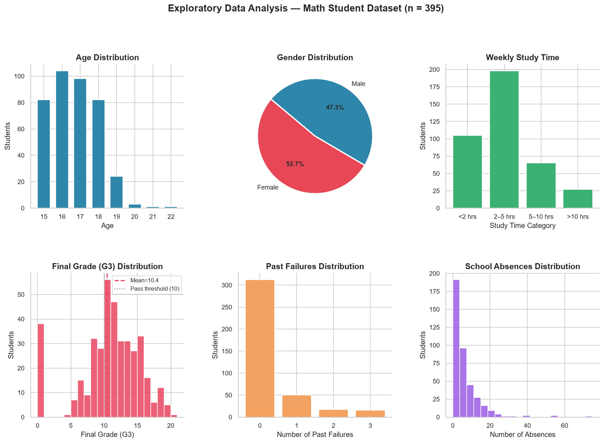
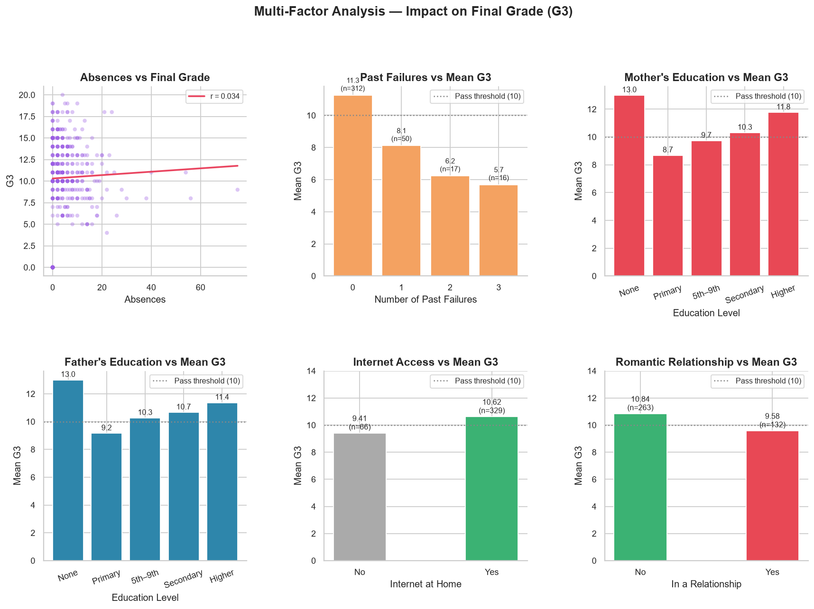
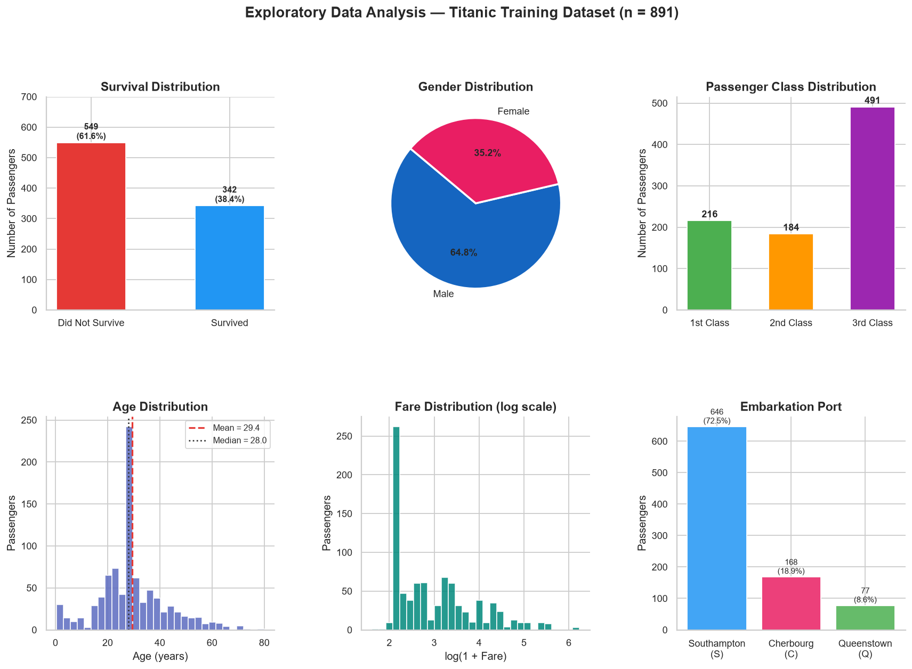

# 📊 Applied Data Science Projects

> A growing collection of applied data science projects completed through real-world analytical tasks, exploring data cleaning, visualization, statistics, and machine learning.

---

## About This Repository

Data science is more than building models.

It begins with understanding data, identifying patterns, asking meaningful questions, and transforming raw information into actionable insights.

This repository documents my hands-on journey through applied data science using Python and modern analytical tools.

Each project follows a structured workflow:

* Data Understanding
* Data Cleaning & Preparation
* Exploratory Data Analysis (EDA)
* Statistical Analysis
* Data Visualization
* Insight Generation
* Predictive Analytics & Machine Learning (where applicable)

---

## Repository Structure

```text
Applied-Data-Science-Projects/

├── Task_01_Student_Performance_Analysis/
├── Task_02_Titanic_Survival_Analysis/
├── Task_03/
├── Task_04/
├── Task_05/
├── Task_06/
```

---

# 🚀 Current Projects

## 📊 Task 01 — Student Performance Analysis

An end-to-end educational data analytics project focused on identifying factors that influence student academic performance.

### Key Areas Explored

* Academic Performance Analysis
* Study Time vs Grades
* Gender-Based Performance Comparison
* Failure Rate Analysis
* Attendance Analysis
* Cross-Subject Performance Comparison
* Correlation Analysis

### Technologies

Python • Pandas • NumPy • Matplotlib • Seaborn • Jupyter Notebook

### Project Visuals





---

## 🚢 Task 02 — Titanic Survival Analysis

An exploratory data analysis project focused on understanding the factors that influenced passenger survival aboard the Titanic.

### Questions Investigated

* Who survived more: males or females?
* Did passenger class affect survival?
* How did age influence survival outcomes?
* Did family structure impact survival chances?

### Technologies

Python • Pandas • NumPy • Matplotlib • Seaborn • Jupyter Notebook

### Project Visuals



---

## 🛠 Skills Demonstrated

### Data Analysis

* Data Cleaning
* Data Validation
* Exploratory Data Analysis
* Feature Engineering
* Statistical Analysis

### Visualization

* Histograms
* Scatter Plots
* Bar Charts
* Comparative Analysis Charts
* Correlation Heatmaps

### Tools & Technologies

* Python
* Pandas
* NumPy
* Matplotlib
* Seaborn
* Jupyter Notebook
* Git & GitHub

---

## 🎯 Repository Goal

The purpose of this repository is to document practical data science projects and demonstrate the process of converting raw data into meaningful insights through analytical thinking and data-driven exploration.

Each task represents a complete project and contributes to a growing portfolio of applied data science work.

---

## 🔄 Upcoming Projects

Additional analytical and machine learning projects will be added as new tasks are completed.

More projects coming soon.

---

## 👩‍💻 About Me

**Hifza Amir**

B.Tech CSE (Data Science)

Passionate about Data Science, Analytics, Machine Learning, NLP, Explainable AI, and building projects that transform data into actionable insights.
